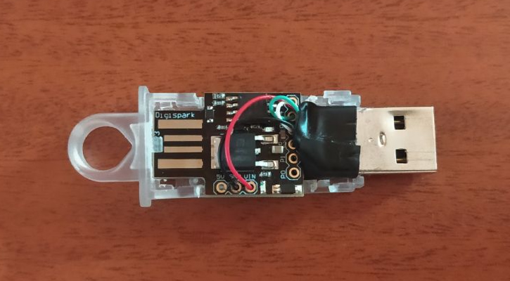
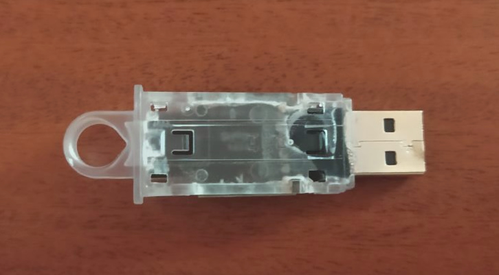
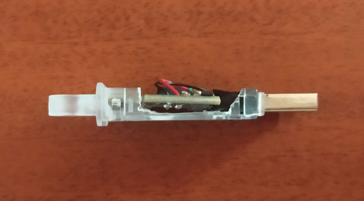

    <h1>Good Boy - Linux Files Watchdog</h1>
    ATtiny85 rubber ducky stager, PrivEsc scripts & remote Watchdog.

 

Good Boy is a specialized security research project designed for automated staging and persistence on Linux systems. It leverages the small form factor of an ATtiny85 (Digispark/Rubber Ducky) embedded within a 32GB flash drive casing to act as a hardware-based HID injector.

The project follows a two-stage execution flow:

1. The Stager (Hardware): An ATtiny85 simulating a USB keyboard to inject a series of commands.

2. The Payloads (Software): A multi-stage retrieval process that downloads a Privilege Escalation (PrivEsc) exploit and the primary Watchdog service.

## System Architecture

The project is split into the hardware firmware and the remote-hosted payloads.

### 1. Hardware Stager (ATtiny85)

The ATtiny85 is integrated into a 32GB flash drive casing for a low-profile aesthetic. It is programmed to wait for a specific delay upon insertion, input a series of keystrokes to open a terminal, download the PrivEsc payload and execute it.

    
    
    

### 2. Payloads

* **PrivEsc Payload:** This script implements a credential harvesting alias by injecting a fake sudo wrapper into the .bashrc file. This wrapper mimics the standard password prompt to log the user's credentials to a hidden file before silently passing the input to the legitimate sudo binary to avoid detection.

* **Watchdog Payload:** A background service that monitors specific file integrity, logs access, or maintains a persistent reverse shell.

## Disclaimer

This project is for educational and authorized security testing purposes only. Using this tool on systems you do not have explicit permission to access is illegal and unethical.
